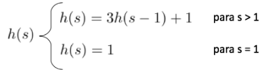
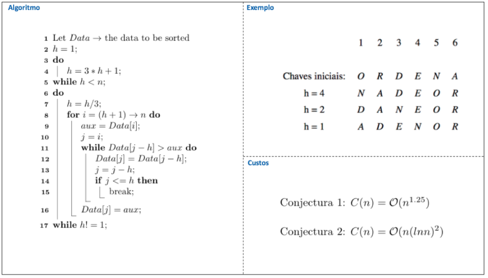

# Shell Sort: Implementação em C

 
 
 
 

 

 

Desenvolvido e apresentado em 1959 por Donald Shell, o método de ordenação Shell Sort é considerado uma evolução / extensão do método de ordenação por inserção e apresenta-se como o método mais eficiente entre os de custo computacional quadrático. No método de seleção ou seleção direta, um conjunto de elementos é ordenado observando-se a ordem par a par, permutando esses pares quando necessário ao caminhar pelo conjunto de forma linear. Já no método de Donald Shell, os elementos em uma distância pré-determinada <i>H</i> são verificados e, caso necessário, ordenados. Assim, todo salto de tamanho <i>H</i> no conjunto deve levar a uma sequência ordenada de elementos, sequência essa chamada de h-ordenada. 

Nesse modelo de algoritmo, o ponto forte é encontrar um valor de salto, i.e., <i>H</i> adequado e eficiente. Sabendo disso, em 1973 Donald Knuth descreveu, em um de seus trabalhos, que uma boa sequência de saldos para esse modelo de ordenação deveria utilizar como referência a seguinte fórmula: 

	 

Vejamos como os saltos contribuem para a ordenação e como a fórmula proposta por Knuth é aplicada a partir da descrição do algoritmo por um pseudo código. Além disso, observaremos um pequeno exemplo de ordenação para a sua representação de passos. O exemplo apresentado faz parte do livro <i>Projeto de Algoritmos com Implementações em Pascal e C</i> do professor Nívio Ziviani.

	 

Uma peculiaridade do shell sort, em comparação com os demais algoritmos de custo quadrático, é a não utilização de sentinelas no vetor, isso porque, por definição, seria preciso inúmeras posições dessas para coordenar os múltiplos saltos de diferentes tamanhos realizados no vetor. Um outro ponto a ser considerado é que não se sabe ao certo qual é o custo computacional exato do algoritmo, o que nos leva a considerar as conjecturas até agora apresentadas e não questionadas pela comunidade científica. Podemos apresentar como vantagens e desvantagens desse algoritmo:

> <b>Vantagens</b>: 
>
>O shell sort é um método excelente para arquivos de tamanho moderado (i.e., médios) e sua implementação, por ser variante do método de inserção, é bem simples e requer uma quantidade de código relativamente pequena. 

> <b>Desvantagens</b>: 
>
>O tempo de execução do shell sort é sensível a ordem de apresentação do conjunto de elementos dado como entrada e o método é classificado como não estável. 

# Compilação e Execução

A lista dinâmica disponibilizada possui um arquivo Makefile que realiza todo o procedimento de compilação e execução. Para tanto, temos as seguintes diretrizes de execução:

| Comando                |  Função                                                                                           |                     
| -----------------------| ------------------------------------------------------------------------------------------------- |
|  `make clean`          | Apaga a última compilação realizada contida na pasta build                                        |
|  `make`                | Executa a compilação do programa utilizando o gcc, e o resultado vai para a pasta build           |
|  `make run`            | Executa o programa da pasta build após a realização da compilação                                 |

# Contatos

<a style="color:black" href="mailto:michel@cefetmg.br?subject=[GitHub]%20Source%20Dynamic%20Lists">
✉️ <i>michel@cefetmg.br</i>
</a>